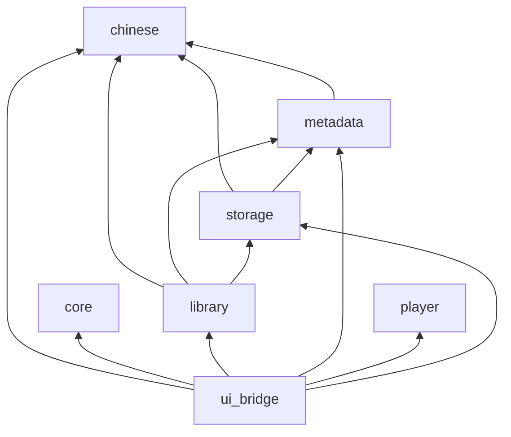

# 清音 Qingyin

轻量、原生、中文优先的 Linux 本地音乐播放器。当前已可导入本地曲库、按拼音搜索与排序、浏览歌手/专辑/目录、查看源文件音频信息和同步本地歌词，并用 GStreamer 播放；可视播放队列与 MPRIS 尚未完成。

## 技术栈

| 层次 | 选型 |
| --- | --- |
| 领域逻辑 | Rust 2024（workspace，`rust-version` 1.92） |
| 界面 | Qt 6 Quick / QML |
| Rust ↔ QML | `qmetaobject` |
| 播放 | GStreamer `playbin`（状态切换在独立 GLib 线程）→ PipeWire |
| 元数据 | Lofty |
| 曲库存储 | SQLite（`rusqlite`，bundled） |
| 中文 | `pinyin` 搜索键 + ICU4X collator 排序 |
| 文件监听 | `notify` |
| 设置 | XDG 下的 TOML |
| 日志 | `tracing` |

桌面媒体控制（MPRIS / `zbus`）已列入技术栈，**运行时代码尚未接通**。

## 开发环境

需要 Rust 1.92+，以及 Qt 6、Qt Quick Controls、GStreamer、PipeWire 和 `pkg-config`。构建脚本通过 `qmake6` 定位 Qt 6。

```bash
cargo fmt --all -- --check
cargo test --workspace
cargo clippy --workspace --all-targets -- -D warnings
bash scripts/check-qml.sh
cargo run -p qingyin-ui-bridge --bin qingyin
```

QML 页面由 `qrc:/qml` 嵌入可执行文件。可设置 `RUST_LOG=qingyin=debug` 查看调试日志。

## 正在播放与歌词

- 点击底部播放器封面进入全页歌词；`Esc` 返回曲库，`F11` 切换系统全屏。歌曲标题仍可用于定位当前歌曲。
- 优先读取歌曲旁的同名 `.lrc`（例如 `歌曲.flac` / `歌曲.lrc`），同名文件缺失或内容为空时读取内嵌文本歌词。支持 UTF-8、带 BOM 的 UTF-16、普通文本、多时间戳、`[offset:毫秒]` 和同时间译文。
- 点击带时间戳的歌词跳转；手动滚动暂停自动跟随，点击“回到当前歌词”恢复。歌词在打开歌词页面或胶囊模式时异步读取，切歌丢弃过期结果，页面切换共享当前播放会话。
- 点击封面下方的音频摘要查看源文件格式、采样率、位深、声道、码率、文件大小和路径。未知参数不显示；MP4、MPEG 等格式名称不代表具体编码器或声卡输出规格。
- 数据库升级至 v6 后，下一次启动扫描会重新读取已有歌曲，补齐源文件属性并保留歌曲 ID。文件未变化时，后续扫描继续使用缓存。

交互检查：`bash scripts/qml-interaction-check.sh`。`cargo test --workspace` 包含使用隔离 XDG 目录和 GStreamer `fakesink` 的真实播放链路测试。

## 窗口操作

曲库、歌词和设置页共用无边框圆角窗口，顶部提供最小化、最大化／还原和关闭按钮。拖动顶部空白区域移动窗口，双击最大化／还原；四边及四角支持系统缩放。最大化时取消圆角，全屏时隐藏窗口栏，可用 `F11` 进入或退出全屏。

## 胶囊模式

- 点击底部播放器音量左侧的胶囊图标，一键切换为 420 × 72 的无边框小窗口；默认显示封面、当前歌词和播放／暂停，无同步歌词时显示歌名。
- 鼠标悬停后向下展开到 420 × 132，显示歌名、歌手、上一首／下一首、进度条和返回按钮。移开后延迟 450 ms 收起；键盘操作或拖动进度条时保持展开。
- 点击封面、展开区返回按钮或按 `Esc` 回到原窗口。原窗口的尺寸、全屏状态和曲库浏览位置保留；关闭胶囊窗口也返回主窗口。
- 在歌词或空白区域按住拖动窗口，移动交给窗口管理器处理。胶囊与主窗口共享播放状态，隐藏主窗口时暂停其背景捕获并卸载大歌词页。

## 安装

```bash
PREFIX=/usr/local bash packaging/install.sh
QT_QPA_PLATFORM=offscreen qingyin --smoke
PREFIX=/usr/local bash packaging/install.sh uninstall
```

干净测试前缀：`bash scripts/check-install.sh`。QML 不单独安装；运行时需要 Qt 6 Quick Controls / Layouts / Dialogs / Window，以及 GStreamer `base`/`good` 与 PipeWire 插件。

## 仓库结构

```
qingyin/
├── crates/
│   ├── chinese/      # 拼音搜索键、排序键、ICU 比较
│   ├── metadata/     # Lofty 读标签 / 封面，TrackMetadata
│   ├── storage/      # SQLite schema、upsert、搜索
│   ├── library/      # 扫描、增量刷新、监听、歌手/专辑聚合
│   ├── player/       # GStreamer 播放
│   ├── core/         # 设置（TOML）
│   └── ui_bridge/    # 应用入口、AppBridge、封面缓存
├── qml/              # Qt Quick 界面
├── docs/
└── assets/
```

产品边界与桥接决策见 [docs/architecture.md](docs/architecture.md)。开发阶段与待办见 [docs/roadmap.md](docs/roadmap.md)。

---

## 架构总览

原则：**Rust 负责逻辑，QML 只负责展示与输入**。QML 不直接访问文件系统、SQLite、Lofty 或 GStreamer。扫描、搜索、封面解码、文件监听在工作线程执行，结果经 `qmetaobject::queued_callback` 回到 Qt 主线程，再改模型与属性。

```
┌──────────────────────────────────────────┐
│              Qt Quick / QML              │
│  Library / Artist / Album / TrackTable   │
│  PlayerBar / Settings / QQC2 Controls    │
└────────────────────┬─────────────────────┘
                     │ 属性 / 信号 / 方法
                     ▼
┌──────────────────────────────────────────┐
│         ui_bridge · AppBridge            │
│  LibrarySession · TrackListModel · PlaybackController │
└──────┬──────────┬──────────┬─────────────┘
       │          │          │
       ▼          ▼          ▼
   library     player      core::Settings
   storage     GStreamer   ~/.config/qingyin/
   metadata    playbin
   chinese
```

运行时真正的编排者是 `AppBridge`。曲库页绑定 `LibrarySession`，曲库表绑定 `TrackListModel`，播放栏绑定 `PlaybackController`。扫描与监听的 `queued_callback` 回到 `LibrarySession`。关闭时设置、曲库 worker 与播放后端都有期限。

## 模块依赖

箭头表示 **Cargo 依赖方向**（只允许指向更底层的 crate）。



| Crate | 职责 | 依赖的本仓库 crate |
| --- | --- | --- |
| `chinese` | `search_key`、`sort_key`、`compare_keys`、多音字、去包裹括号 | 无 |
| `metadata` | `TrackMetadata`、`read_track`、`read_cover` | `chinese`（算排序键） |
| `storage` | SQLite、搜索索引、排序标签列 | `metadata`、`chinese` |
| `library` | 递归扫描、`refresh_path`、`notify` 监听、内存聚合歌手/专辑 | `metadata`、`storage`、`chinese` |
| `player` | GStreamer `playbin`、命令 ID、加载世代、fake backend | 无 |
| `core` | `Settings` / `SettingsLoad`、XDG 路径、`SortColumn` | 无 |
| `ui_bridge` | 进程入口、`AppBridge`、`LibrarySession`、列表模型、`PlaybackController`、设置后台写入 | 以上全部 |

**依赖方向上成立的约束：** `chinese` 在最底，QML 只依赖 `ui_bridge`，播放与存储互不引用。

**实际偏离：** `ui_bridge` 绕过 `core` 直接依赖 `library` / `player` / `storage` / `metadata` / `chinese`，`core` 没有成为应用服务层。`metadata` 依赖 `chinese` 是为了把排序键塞进 `TrackMetadata`，领域模型和校对算法绑在了一起。

## 数据流转

### 启动

1. `qingyin` 初始化 `tracing`，注册 `Qingyin` 类型，从 `qrc:/qml/Main.qml` 加载嵌入资源；根组件未就绪则非零退出。
2. `Main.qml` 的 `Component.onCompleted` 调用 `restore_session()`。
3. 主线程读取 XDG 配置。只有成功读到的 roots 才会 prune；缺失或损坏配置保留已有曲库。
4. 迁移在打开数据库的事务中完成；工作线程使用已迁移连接，不再重复升级。
5. 冷启动先发布文字和已有封面缓存 URL，缺失封面由调度器按 ID 补图。
6. 若设置里有音乐目录：后台扫描并对账，同时 `notify` 递归监听。

### 导入 / 全量扫描

```
界面选择文件夹
  → 工作线程 scan_directory_with
      → 递归收集音频；子树权限/I/O 失败记入 failed_subtrees，不前缀删除
      → 与 SQLite 中高精度 mtime + 文件大小比较
      → Lofty 读标签和前封面，upsert 返回稳定 ID
      → 完整成功的根做存量对账
      → 封面按内容摘要写入缓存，不在 Qt 线程解码
  → queued_callback 回到主线程
      → 校验 roots 世代后更新共享 TrackSnapshot 模型
```

扫描不阻塞 Qt 主线程。单个损坏文件记入失败计数，不中止整次扫描。

### 运行期文件变化

```
inotify 事件
  → 忽略 Access；父子路径合并
  → 安静窗口 400ms，最长等待 2s；有界邮箱溢出只登记一次对账
  → 独立工作线程打开已迁移的 SQLite 连接、刷新、聚合、准备封面
  → 主线程按 upsert/remove ID 做增量模型更新；溢出则 snapshot reset
```

临时文件（`.part` / `.tmp` / `.temp`）和监听根目录之外的路径会被忽略。删除根路径 `/` 不会清空曲库。

### 搜索与排序

- 搜索在单个长期 worker 中执行，只保留最新查询。汉字只匹配原文；纯拼音/首字母才走 `full_pinyin` / `initials`。roots 过滤在 LIMIT 之前。界面最多展示 500 条，并标明 `has_more`。
- 排序在内存中移动共享 `TrackSnapshot`。歌名/专辑使用快照上的校对键（标题语境与人名语境分开），时长按数字比。专辑详情默认 disc/track。

### 播放

```
列表双击某一行（携带稳定 TrackId）
  → PlaybackController 持有共享快照队列，与曲库筛选/排序解耦
  → 命令带 ID；Progress/Error/EOS 带加载世代，过期事件丢弃
  → GStreamer 在独立线程初始化；窗口不可见时降低进度发布频率
```

上一首/下一首作用在 `playback_tracks` 上，而不是尚未实现的可视队列。列表播完后停止。音量写入设置。

## 关键组件

### 播放后端（`crates/player`）

- 使用单一 `playbin`。若系统没有 `autoaudiosink`，尝试 `pipewiresink`。
- `load` 校验普通文件、canonicalize、按扩展名检查 FLAC/MP3 相关插件，再把路径变成 URI。
- `play` / `pause` 发出状态请求后立即返回，不等待 pipeline preroll；后续失败经 Bus 回传。
- Bus watch 挂在独立 `GLib` 主循环上；`load` / `play` / `pause` / `seek` 也排队到这条线程，避免和 Qt 主线程同时碰 `playbin`。仅在 `Playing` 时推送进度。
- 析构时将 pipeline 置 `Null`，并停止 Bus 线程。

播放会话状态（当前行、标题、封面 URL、错误文案）由 `PlaybackController` 持有，不在 `Player` 内，也不再堆在会话对象上。

### 文件扫描（`crates/library`）

- 支持扩展名：`aac` `aif` `aiff` `ape` `flac` `m4a` `mp3` `mp4` `mpc` `ogg` `opus` `spx` `wav` `wv`（大小写不敏感）。
- `scan_directory`：DFS 收集路径；子树失败不前缀删除；完整成功的根做对账；导入最多 50 首一批。
- `refresh_watched_path`：目录扫描或前缀删除；音频按指纹 upsert；临时文件和非监视路径忽略。
- 监听 worker 在后台写库并准备 snapshot；Qt 只应用结果。
- 歌手/专辑按稳定 `AlbumKey` / 歌手名聚合；合辑按 album artist；未知值使用显式类型。

### 存储（`crates/storage`）

路径：`$XDG_DATA_HOME/qingyin/library.sqlite3`（通常为 `~/.local/share/qingyin/library.sqlite3`）。

当前 `PRAGMA user_version = 5`。每个版本升级在事务中完成，成功后才更新 `user_version`；未来版本拒绝打开。打开时启用 WAL、`busy_timeout=5000` 和外键。

指纹字段为 `modified_at_ns` 与 `file_size`。封面摘要 `cover_digest` 入库，缓存文件按摘要寻址（cache v2）。路径前缀删除使用转义后的大小写敏感 `GLOB`。

**`tracks`**

| 列 | 含义 |
| --- | --- |
| `id` | 主键 |
| `path` | 本地绝对路径，UNIQUE，非 UTF-8 拒绝入库 |
| `title` / `album` | 展示名；专辑可空 |
| `duration_ms` | 可空，溢出则报错 |
| `modified_at_ns` / `file_size` | 高精度指纹 |
| `cover_digest` | 内嵌封面 SHA-256，可空 |
| `album_artist` / `disc_number` / `track_number` | 专辑身份与曲序 |
| `title_sort` / `album_sort` / `artist_sort` | Lofty 排序标签，可空；加载后再算内存中的拼音键 |

**`track_artists`**

| 列 | 含义 |
| --- | --- |
| `track_id` | 外键，`ON DELETE CASCADE` |
| `artist` | 歌手名 |
| `position` | 同一曲目内顺序 |

**`search_terms`**

| 列 | 含义 |
| --- | --- |
| `track_id` + `field` + `position` | 主键；`field` 为 `title` / `artist` / `album` |
| `normalized` | 小写原文（去首尾空白） |
| `full_pinyin` / `initials` | 汉字转拼音后的全拼与首字母，供无汉字查询使用 |

界面排序**不**走 SQL `ORDER BY` 拼音。`list_tracks` 仅按 `title, path` 取数，拼音序在内存里排。

封面不入库原图：首次解析计算内容摘要，缓存为 digest 文件；冷启动命中映射则不回读音频。模型只暴露 URL。`CoverImage` 按显示档位和 DPR 设置 `sourceSize`。

### 中文层（`crates/chinese`）

- **搜索键：** 去空白并小写；汉字 → 无声调拼音；字母数字原样进入全拼与首字母。
- **排序键：** 显式区分标题与人名语境；`ARTISTSORT` / `TITLESORT` / `ALBUMSORT` 优先。
- **比较：** 进程内 `OnceLock` 的 ICU collator，Secondary strength（忽略大小写）。

### 设置

`~/.config/qingyin/settings.toml`：版本化 TOML，原子替换保存。损坏或未来版本不会用空 roots 清库。音量限制在 0–1；未知排序列回退到默认。
