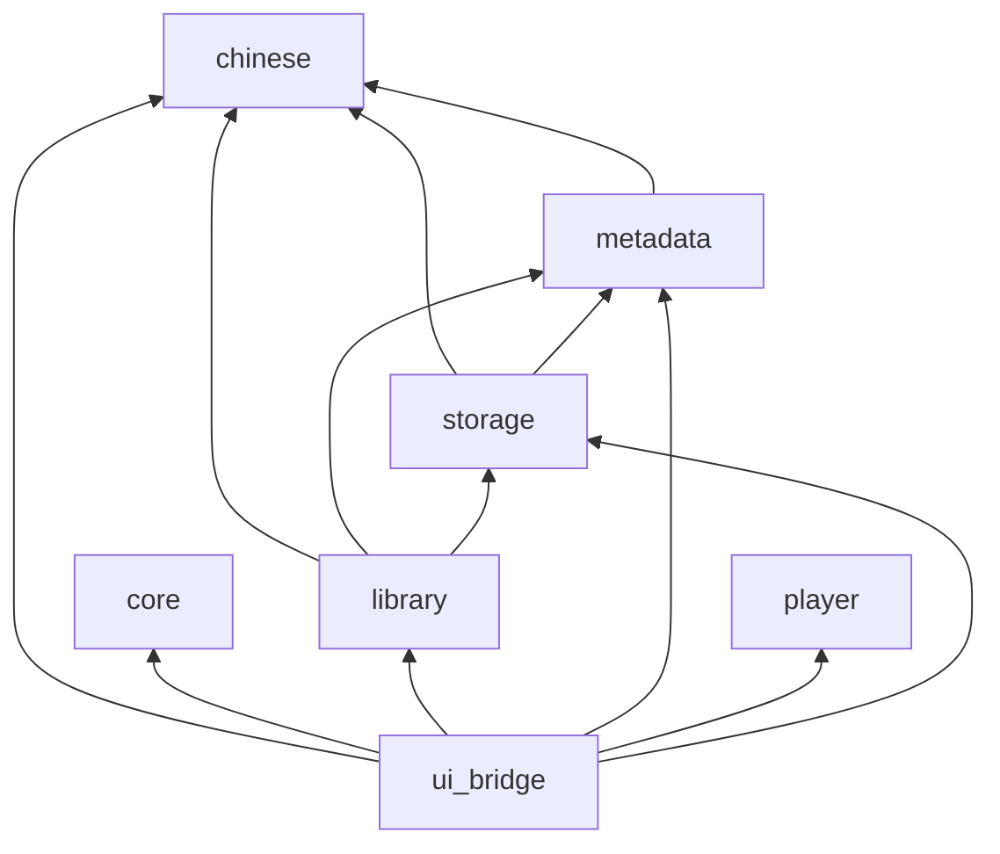

# 清音 Qingyin

轻量、原生、中文优先的 Linux 本地音乐播放器。当前已可导入本地曲库、按拼音搜索与排序、浏览歌手/专辑，并用 GStreamer 播放；可视播放队列与 MPRIS 尚未完成。

## 技术栈

| 层次 | 选型 |
| --- | --- |
| 领域逻辑 | Rust 2024（workspace，`rust-version` 1.92） |
| 界面 | Qt 6 Quick / QML |
| Rust ↔ QML | `qmetaobject` |
| 播放 | GStreamer `playbin`（状态切换在独立 GLib 线程）→ PipeWire |
| 元数据 | Lofty |
| 曲库存储 | SQLite（`rusqlite`，bundled） |
| 中文 | `pinyin` 搜索键 + ICU4X collator 排序 |
| 文件监听 | `notify` |
| 设置 | XDG 下的 TOML |
| 日志 | `tracing` |

桌面媒体控制（MPRIS / `zbus`）已列入技术栈，**运行时代码尚未接通**。

## 开发环境

需要 Rust 1.92+，以及 Qt 6、Qt Quick Controls、GStreamer、PipeWire 和 `pkg-config`。构建脚本通过 `qmake6` 定位 Qt 6。

```bash
cargo fmt --all -- --check
cargo test --workspace
cargo clippy --workspace --all-targets -- -D warnings
/usr/lib/qt6/bin/qmllint -I qml qml/*.qml
cargo run -p qingyin-ui-bridge
```

可设置 `RUST_LOG=qingyin=debug` 查看调试日志。

指针假死排查：

```bash
QINGYIN_POINTER_DEBUG=1 cargo run -p qingyin-ui-bridge
```

终端和 `/tmp/qingyin-pointer.log` 会记下按钮按下/松开/点击，以及 `play_next` 等槽调用。若点了「下一首」但没有 `slot play_next`，事件没有到达 `AppBridge`。

## 仓库结构

```
qingyin/
├── crates/
│   ├── chinese/      # 拼音搜索键、排序键、ICU 比较
│   ├── metadata/     # Lofty 读标签 / 封面，TrackMetadata
│   ├── storage/      # SQLite schema、upsert、搜索
│   ├── library/      # 扫描、增量刷新、监听、歌手/专辑聚合
│   ├── player/       # GStreamer 播放
│   ├── core/         # 设置（TOML）
│   └── ui_bridge/    # 应用入口、AppBridge、封面缓存
├── qml/              # Qt Quick 界面
├── docs/
└── assets/
```

产品边界与桥接决策见 [docs/architecture.md](docs/architecture.md)。功能完成度见 [docs/development-status.md](docs/development-status.md)。质量改动勾选清单见 [docs/quality-changes.md](docs/quality-changes.md)。

---

## 架构总览

原则：**Rust 负责逻辑，QML 只负责展示与输入**。QML 不直接访问文件系统、SQLite、Lofty 或 GStreamer。扫描、搜索、封面解码、文件监听在工作线程执行，结果经 `qmetaobject::queued_callback` 回到 Qt 主线程，再改模型与属性。

```
┌──────────────────────────────────────────┐
│              Qt Quick / QML              │
│  Library / Artist / Album / TrackTable   │
│  PlayerBar / Settings / QQC2 Controls    │
└────────────────────┬─────────────────────┘
                     │ 属性 / 信号 / 方法
                     ▼
┌──────────────────────────────────────────┐
│         ui_bridge · AppBridge            │
│  LibrarySession · TrackListModel · PlaybackController │
└──────┬──────────┬──────────┬─────────────┘
       │          │          │
       ▼          ▼          ▼
   library     player      core::Settings
   storage     GStreamer   ~/.config/qingyin/
   metadata    playbin
   chinese
```

运行时真正的编排者是 `AppBridge`。曲库页绑定 `LibrarySession`，曲库表绑定 `TrackListModel`，播放栏绑定 `PlaybackController`。扫描与监听的 `queued_callback` 回到 `LibrarySession`，不经过巨型会话方法列表。

## 模块依赖

箭头表示 **Cargo 依赖方向**（只允许指向更底层的 crate）。



| Crate | 职责 | 依赖的本仓库 crate |
| --- | --- | --- |
| `chinese` | `search_key`、`sort_key`、`compare_keys`、多音字、去包裹括号 | 无 |
| `metadata` | `TrackMetadata`、`read_track`、`read_cover` | `chinese`（算排序键） |
| `storage` | SQLite、搜索索引、排序标签列 | `metadata`、`chinese` |
| `library` | 递归扫描、`refresh_path`、`notify` 监听、内存聚合歌手/专辑 | `metadata`、`storage`、`chinese` |
| `player` | `playbin` 加载/播放/暂停/seek/音量、Bus 事件 | 无 |
| `core` | `Settings` TOML | 无 |
| `ui_bridge` | 进程入口、`AppBridge`、`LibrarySession`、`TrackListModel`、`PlaybackController`、封面缩放缓存 | 以上全部 |

**依赖方向上成立的约束：** `chinese` 在最底，QML 只依赖 `ui_bridge`，播放与存储互不引用。

**实际偏离：** `ui_bridge` 绕过 `core` 直接依赖 `library` / `player` / `storage` / `metadata` / `chinese`，`core` 没有成为应用服务层。`metadata` 依赖 `chinese` 是为了把排序键塞进 `TrackMetadata`，领域模型和校对算法绑在了一起。

## 数据流转

### 启动

1. `qingyin-ui-bridge` 初始化 `tracing`，注册 `Qingyin.AppBridge`，加载源码树中的 `qml/Main.qml`。
2. `Main.qml` 的 `Component.onCompleted` 调用 `restore_session()`。
3. 主线程读取 `~/.config/qingyin/settings.toml`（缺失则用默认值），恢复主题、音量、排序列、音乐目录。
4. 主线程打开 `~/.local/share/qingyin/library.sqlite3`，`list_tracks` 填入内存模型，并为每首曲目准备封面 URL。
5. 若设置里有音乐目录：后台线程按 mtime 核对磁盘，同时 `notify` 开始递归监听。

### 导入 / 全量扫描

```
界面选择文件夹
  → 工作线程 scan_directory
      → 递归收集音频扩展名
      → 与 SQLite 中 modified_at 比较，未变化则跳过
      → Lofty 读标签，upsert tracks / track_artists / search_terms
      → 再 list_tracks，解码并缩放内嵌封面到缓存目录
  → queued_callback 回到主线程
      → 更新 library_tracks、可见列表、歌手/专辑聚合
      → 把目录写入 settings.toml，重启 watcher
```

扫描不阻塞 Qt 主线程。单个损坏文件记入失败计数，不中止整次扫描。

### 运行期文件变化

```
inotify 事件
  → 忽略 Access；已存在目录的普通 Modify 不触发整树扫描
  → 400ms 合并路径
  → 独立工作线程打开自己的 SQLite 连接
      → MusicLibrary::refresh_path（导入 / 更新 / 按路径或前缀删除）
  → 主线程重新 list_tracks 一次，复用未变路径+mtime 的封面 URL
```

临时文件（`.part` / `.tmp` / `.temp`）和监听根目录之外的路径会被忽略。删除根路径 `/` 不会清空曲库。

### 搜索与排序

- 搜索在工作线程执行。查询含汉字时只匹配原文；纯拼音/首字母才走 `full_pinyin` / `initials`。歌名命中优先于歌手、专辑。界面最多展示 500 条。
- 排序在内存中进行。歌名/专辑使用装入 UI 快照时算好的校对键（标签优先，否则汉字转无声调拼音；含假名或韩文则保留原文；前缀/包裹括号不进入键），再用 ICU Secondary 比较。时长按数字比。`ARTISTSORT` 等标签仍写入 SQLite，派生键不落库。

### 播放

```
列表双击某一行
  → PlaybackController 复制当前列表为 playback_tracks（与曲库筛选/排序解耦）
  → 主线程 Player::load + play（playbin，URI 为本地文件，不等待 preroll）
  → Playing 时由播放器推送 position
  → GLib Bus watch：EOS 自动下一首，Error 回传界面
```

上一首/下一首作用在 `playback_tracks` 上，而不是尚未实现的可视队列。列表播完后停止。音量写入设置。

## 关键组件

### 播放后端（`crates/player`）

- 使用单一 `playbin`。若系统没有 `autoaudiosink`，尝试 `pipewiresink`。
- `load` 校验普通文件、canonicalize、按扩展名检查 FLAC/MP3 相关插件，再把路径变成 URI。
- `play` / `pause` 发出状态请求后立即返回，不等待 pipeline preroll；后续失败经 Bus 回传。
- Bus watch 挂在独立 `GLib` 主循环上；`load` / `play` / `pause` / `seek` 也排队到这条线程，避免和 Qt 主线程同时碰 `playbin`。仅在 `Playing` 时推送进度。
- 析构时将 pipeline 置 `Null`，并停止 Bus 线程。

播放会话状态（当前行、标题、封面 URL、错误文案）由 `PlaybackController` 持有，不在 `Player` 内，也不再堆在会话对象上。

### 文件扫描（`crates/library`）

- 支持扩展名：`aac` `aif` `aiff` `ape` `flac` `m4a` `mp3` `mp4` `mpc` `ogg` `opus` `spx` `wav` `wv`（大小写不敏感）。
- `scan_directory`：DFS 收集路径，按路径排序后逐个处理；`modified_at` 为 Unix 秒；导入按最多 50 首一批提交。
- `refresh_path`：目录走扫描或前缀删除；音频文件走单曲 upsert；非音频且已入库则删除该行。不自动 `sync_tracks`。
- 监听 worker 只写 SQLite；需要内存列表时显式 `sync_from_database`。一批 debounce 路径对应 UI 一次全表加载。
- 歌手/专辑聚合在内存完成：一首歌多个歌手会进入多个歌手组；无歌手/无专辑归入「未知歌手」「未知专辑」，并排在列表末尾。

### 存储（`crates/storage`）

路径：`$XDG_DATA_HOME/qingyin/library.sqlite3`（通常为 `~/.local/share/qingyin/library.sqlite3`）。

当前 `PRAGMA user_version = 4`。打开时启用 WAL、`busy_timeout=5000` 和外键；v1→v2 重建分字段 `search_terms`；v2→v3 增加可空排序标签列；v3→v4 为 `search_terms(field, normalized|full_pinyin|initials)` 建索引。

**`tracks`**

| 列 | 含义 |
| --- | --- |
| `id` | 主键 |
| `path` | 本地绝对路径，UNIQUE，非 UTF-8 拒绝入库 |
| `title` / `album` | 展示名；专辑可空 |
| `duration_ms` | 可空，溢出则报错 |
| `modified_at` | 文件 mtime（秒），用于跳过未改动文件 |
| `title_sort` / `album_sort` / `artist_sort` | Lofty 排序标签，可空；加载后再算内存中的拼音键 |

**`track_artists`**

| 列 | 含义 |
| --- | --- |
| `track_id` | 外键，`ON DELETE CASCADE` |
| `artist` | 歌手名 |
| `position` | 同一曲目内顺序 |

**`search_terms`**

| 列 | 含义 |
| --- | --- |
| `track_id` + `field` + `position` | 主键；`field` 为 `title` / `artist` / `album` |
| `normalized` | 小写原文（去首尾空白） |
| `full_pinyin` / `initials` | 汉字转拼音后的全拼与首字母，供无汉字查询使用 |

界面排序**不**走 SQL `ORDER BY` 拼音。`list_tracks` 仅按 `title, path` 取数，拼音序在内存里排。

封面不入库：扫描导入时一次 Lofty 打开同时出标签和封面，缩到最长边 512 写成 PNG。缓存文件名为路径哈希 + mtime。冷启动只拼接已有 `file://` URL；缺缓存时在扫描未变化文件上再回源。模型只暴露 URL。

### 中文层（`crates/chinese`）

- **搜索键：** 去空白并小写；汉字 → 无声调拼音；字母数字原样进入全拼与首字母。
- **排序键：** `ARTISTSORT` / `TITLESORT` / `ALBUMSORT` 优先；去掉前缀/包裹括号（保留括号内正文）；含平假名/片假名/韩文则不再转拼音；其余汉字转拼音（曾/单/乐等走内置多音字）。
- **比较：** 进程内 `OnceLock` 的 ICU collator，Secondary strength（忽略大小写）。

### 设置

`~/.config/qingyin/settings.toml`：`music_directories`、`dark_theme`、`volume`、`sort_column`、`sort_ascending`。音量限制在 0–1；未知排序列会丢弃。
