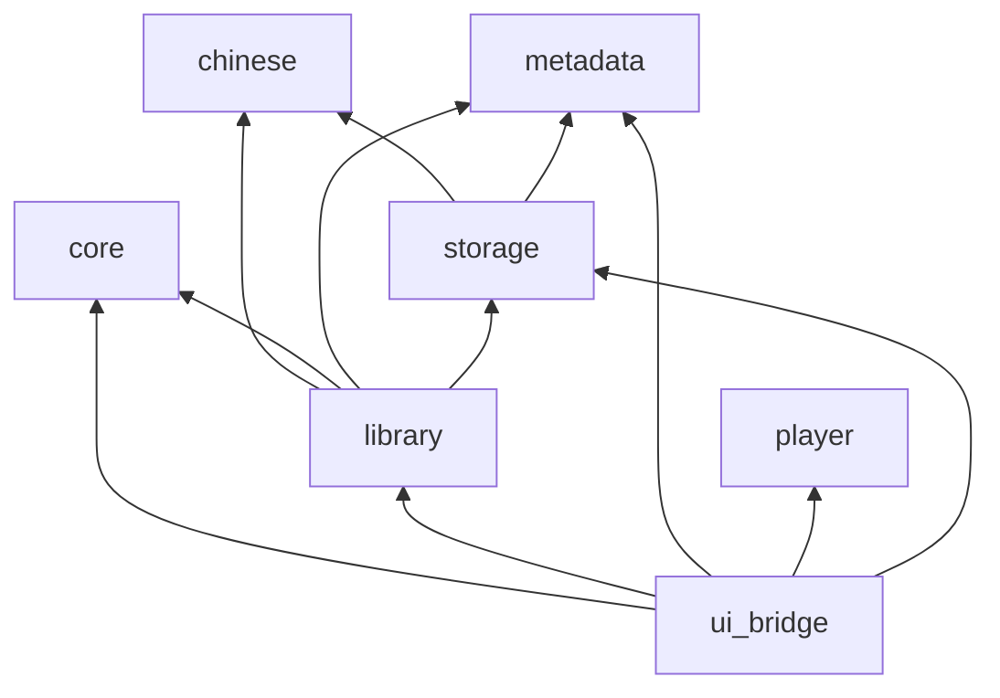

# 架构

清音是轻量、原生、中文优先的 Linux 本地音乐播放器。Rust 负责曲库、播放和设置，QML 只负责展示和输入。播放与解码使用 GStreamer，不自研音频缓冲。

## 技术边界

| 层次 | 选型 | 现状 |
| --- | --- | --- |
| 领域逻辑 | Rust 2024 | 使用中 |
| 界面 | Qt 6 Quick / QML | 页面嵌入 `qrc:/qml` |
| 桥接 | `qmetaobject` | `AppBridge`、`LibrarySession`、列表模型、`PlaybackController` |
| 播放 | GStreamer `playbin` | 命令在独立 GLib 线程执行，输出到 PipeWire |
| 元数据 | Lofty | 标签、封面、歌词 |
| 曲库 | SQLite（`rusqlite`，bundled） | schema 6，WAL |
| 中文 | `pinyin` 搜索键，ICU4X 排序 | `library` 与 `storage` 使用 |
| 监听 | `notify` | 有界邮箱，安静窗口后增量刷新 |
| 设置 | XDG 下的 TOML | 原子替换写入 |
| 桌面控制 | MPRIS / `zbus` | 尚未接通 |

QML 不访问文件系统、SQLite、Lofty 或 GStreamer。工作线程的结果经 `queued_callback` 回到 Qt 主线程后，才改模型和属性。

## 模块

依赖只指向更底层的 crate。`ui_bridge` 是组合根，直接组装曲库、播放和设置，不经过额外的服务层。

| Crate | 职责 |
| --- | --- |
| `chinese` | 搜索键、排序键、ICU 比较、多音字 |
| `metadata` | `TrackMetadata`、标签与封面、歌词读取。不依赖 `chinese` |
| `storage` | SQLite、搜索索引、迁移 |
| `library` | 扫描、监听、封面缓存、歌手/专辑/目录聚合。排序键在这里计算 |
| `player` | GStreamer 命令、加载世代、测试用假后端 |
| `core` | 设置、XDG 路径、排序列与播放模式 |
| `ui_bridge` | 入口、会话、模型和播放控制器 |

## 线程与所有权

- 扫描、搜索、封面、监听和歌词读取在工作线程。`QObject` 与模型只在 Qt 主线程修改。
- 主线程曲库是一份按曲目 id 存放的 `TrackSnapshot`。列表和详情只保存 id。标签在 `Arc<TrackMetadata>` 后面，点播队列与曲库共用这份 `Arc`。
- 播放控制线程在有命令或总线消息时才工作。`load` 与随后的 `play` 各自保留完成记录；过期的进度、错误和 EOS 按加载世代丢弃。
- 关闭时设置写入、曲库 worker 和播放后端都有期限。

## 播放与界面

底部播放条、歌词页和胶囊窗口共用 `PlaybackController`。主窗口可见时，播放条背后的磨砂持续抓取；进入胶囊后主窗口隐藏，抓取停止。曲目行封面用同一套圆角裁切绘制悬停遮罩。Hi-Res 标记来自已入库的位深或采样率，不额外读文件。

顺序、单曲循环和随机是播放模式，作用在当前点播队列上。可视播放队列还没有。

## 曲库数据

数据库在 `$XDG_DATA_HOME/qingyin/library.sqlite3`，设置在 `~/.config/qingyin/settings.toml`。

扫描用修改时间和文件大小跳过未改文件，变化文件按批写入。监听邮箱有上限，溢出后做一次对账，而不是无界堆积。搜索在长期 worker 中执行，只保留最新查询；汉字匹配原文，无汉字查询才用全拼和首字母。界面排序使用内存中的校对键，不走 SQL 拼音排序。

`tracks` 保存路径、展示名、时长、指纹、排序标签、封面摘要，以及格式、采样率、位深、声道和码率。歌手在 `track_artists`，搜索键在 `search_terms`。封面原图不入库，按摘要缓存在磁盘上。
